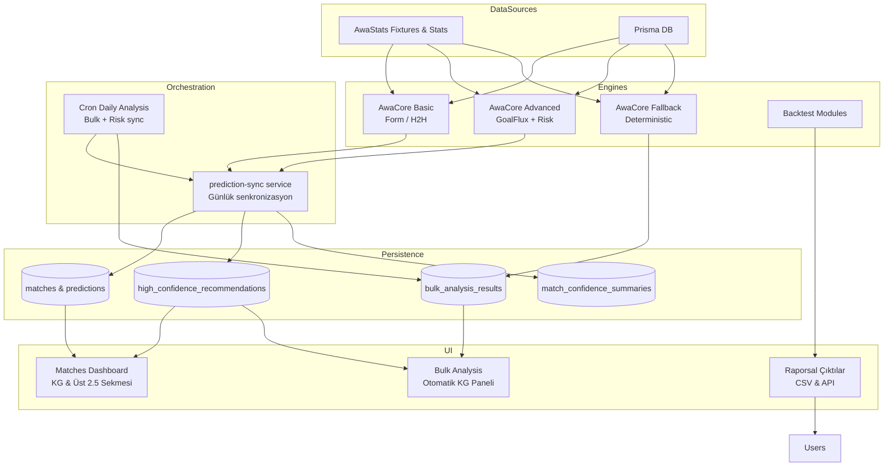

# ⚙️ AwaStats Algorithm & Data Flow Reference

Bu doküman, Eagle platformundaki tahmin ve risk üretimi sürecinde kullanılan
tüm ana AwaStats algoritmalarını, veri bağımlılıklarını ve ince ayar
noktalarını özetler.

> **Not:** AwaStats Nexus'in iç detayları (GoalFlux Kernel, NeuroStack
> Ensemble, ChronoFold Validation, AwaPulse Momentum, AwaCore Fallback)
> özel olarak geliştirilmiş ve ürün sırrı kapsamındadır. Bu referans
> sadece dış davranışı, parametre yüzeyini ve veri akışını belgeler.

## 📚 Algoritma Tablosu

| Modül / Metot | Konum | Amaç | Başlıca Girdiler | Çıktılar & İnce Ayar Parametreleri |
| --- | --- | --- | --- | --- |
| `calculateTeamForm` | `lib/prediction-engine.ts` | Son maçlardan 0-1 arası form skoru üretir | Son 5-10 maç skorları, goller | `form_score` (örnek sayısını ayarlayın) |
| `calculateHomeAdvantage` | `lib/prediction-engine.ts` | H2H kayıtlarından ev avantaj katsayısı çıkarır | H2H galibiyetleri, maç adedi | Varsayılan boost `0.07`, min maç `3` |
| `calculateGoalsAnalysis` | `lib/prediction-engine.ts` | GoalFlux tabanlı gol beklentisi üretir | Ev/deplasman ortalama goller | `home_expected_goals`, `total_expected_goals` (ağırlık katsayıları) |
| `calculateFirstHalfGoals` | `lib/prediction-engine.ts` | İlk yarı gol olasılıkları ve güven hesaplar | Beklenen goller, form tutarlılığı | `firstHalfFactor=0.43`, olasılık eşikleri |
| `predictMatch` | `lib/prediction-engine.ts` | Temel motor; form, H2H, lig pozisyonu, golleri birleştirir | Takım objeleri, form, standings | Winner, BTTS, O/U, ilk yarı tahminleri (ağırlık kombinasyonları) |
| `getAdvancedTeamStats` | `lib/advanced-prediction-engine.ts` | Geniş istatistik seti üretir, fallback değerler sağlar | Veri akışı, fikstürler | Form, BGS, AwaPulse momentum, kart vb. (fallback blok değerleri) |
| `generateExactScores` | `lib/advanced-prediction-engine.ts` | GoalFlux ile skor/olasılık hesaplar | Home/Away λ | Olasılık >%1 olan skorlar (`maxGoals=5`, eşik 0.01) |
| `calculateAsianHandicap` | `lib/advanced-prediction-engine.ts` | Güç farkına göre handicap olasılık/oran | Güç/olasılık verileri | Handicap listesi (katsayı `0.1`) |
| `generateAdvancedPrediction` | `lib/advanced-prediction-engine.ts` | Form + standings + BGS + risk analizi birleştirir | Takım/lig bilgisi, sezon, AwaStats dataları | Maç sonucu dağılımı, goller, corner/kart, risk-highlights (weights `form 0.30`, `home 0.15`, `league 0.15`, `goals 0.20`, `defense 0.15`, `h2h 0.05`) |
| Risk önerileri (`high/medium/high_risk_bets`) | `lib/advanced-prediction-engine.ts` | KG/Üst güvenli öneriler listesi | Confidence, BTTS/Over verileri | Eşikler (`>0.70` high, BTTS >0.72/<0.28, Alt/Üst 2.5 >0.68/<0.32) |
| `syncPredictionsForDate` | `lib/services/prediction-sync.ts` | Gelişmiş tahmin + riskleri Prisma'ya yazar | Tarih, limit, `force` bayrağı | Matches, predictions, high_confidence kayıtları (`skipIfFreshMinutes`) |
| `bulk-analysis` deterministik skorlayıcı | `app/api/bulk-analysis/route.ts` | AwaStats akışı erişilemezse AwaCore fallback üretir | Standings, H2H, defaults | Winner/BTTS/O/U skorları, EV & risk tier (`confidence` hesaplamaları) |
| Backtest modülleri | `lib/backtest-engine.ts`, `lib/comprehensive-backtest.ts` | Tarihsel doğruluk ve ROI analizi | Geçmiş maç/tahmin datası | Strateji sonuçları (stake ayarları) |

## 🕸️ Veri Akışı (Mermaid)

## 🔧 İnce Ayar İpuçları

- **Ağırlıklar:** `lib/advanced-prediction-engine.ts` içinde `weights` objesi (form/home/league/defans) sonuçlara doğrudan etki eder.
- **Risk Eşikleri:** KG & Üst önerileri için `%65+` confidence; `bttsProb` >0.7 veya <0.3 durumları high confidence'e giriyor.
- **GoalFlux Parametreleri:** `maxGoals`, `firstHalfFactor` ve `over_*` eşikleri toplam gol dağılımını etkiler.
- **Senkronizasyon:** `syncPredictionsForDate`'in `skipIfFreshMinutes` paramı günlük analiz sıklığını belirler; cron'da 120 dk varsayılan.
- **AwaCore Fallback:** `app/api/bulk-analysis/route.ts` içindeki deterministic katsayılar AwaStats akışı kısıtlandığında "güncel" skorlar üretir.
- **Çift doğrulama:** `bulk-analysis` verileri AwaStats tahminleriyle birlikte saklanır (`api_*` alanları). `algorithms_agree_*` bayrakları hem AwaCore Advanced hem de AwaStats Nexus aynı tarafı/alt-üstü işaret ettiğinde `true` olur.

Bu dosya, algoritma ince ayarları yapılırken referans olarak kullanılabilir.
